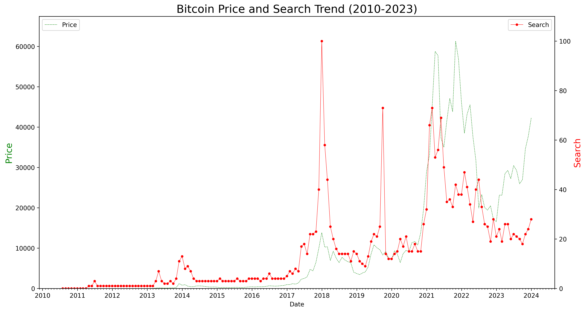
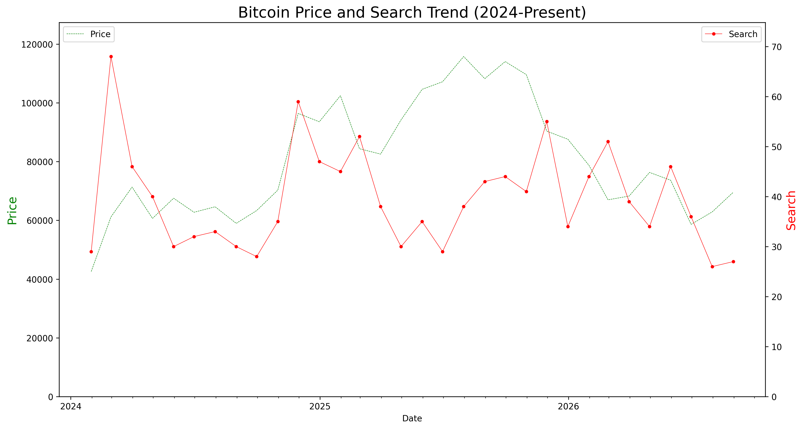

# Bitcoin Price vs. Google Search Interest
A small data project comparing Bitcoin's historical price against public Google 
search interest for "Bitcoin" over time, to see how closely the two move together.

## What this does
Loads daily BTC price data and monthly Google Trends search volume, cleans and 
resamples both to monthly frequency, merges them on date, and plots them together 
on a dual-axis chart; once for 2010–2023, and once for 2024–present.

## Repository structure
```
├── Code/       # Python scripts
├── Data/       # Raw CSV files (price + search trend data)
├── Graph/      # Output chart images
└── README.md
```

## Data sources
- Price data: [Investing.com](https://www.investing.com) — Bitcoin historical price
- Search interest: [Google Trends](https://trends.google.com) — worldwide search volume for "Bitcoin"

## Tools used
Python, pandas, matplotlib

## How to run
Run each script from the repository root (not from inside `code/`), since file 
paths are relative to the root:
```
python code/bitcoin_2010_2023.py
python code/bitcoin_2026.py
```

## Part 1: 2010–2023


## Part 2: 2024–Present


## A Note on the Dual-Axis Chart
This chart uses two independent y-axes — one for price, one for search interest. 
The search axis is fixed to 0–100 (Google Trends' native scale), but the price 
axis auto-scales to its own range. This means visual overlap between the two 
lines shows general co-movement over time, not a precise numeric relationship; 
two series can look more or less aligned depending on how each axis is scaled.

## Analysis
Bitcoin has been a major trend recently, with bears expecting a drop to $40,000 and bulls expecting a rise to $100,000. This gave me the idea to look at how Bitcoin's price aligns with public interest and search trends.

I looked at the period from 2010, when Bitcoin was not yet widely known, until the beginning of 2024, and then separately from 2024 to the present, during which we saw a major uptrend that pushed Bitcoin's price above $100,000 for the first time.

As we can see in the 2010–2023 graph, in the early years Bitcoin attracted far more search interest than its price would suggest. However, there was a strong visual correlation between the two, forming peaks and valleys together; for example, peaks in early 2014 and early 2018, and a valley around 2019. Around 2021, Bitcoin's price saw a sharp increase that overtook search interest, coinciding with the COVID-19 pandemic and the US interest rate cut. Still, the correlation in forming highs and lows persisted; for instance, both the search trend and BTC price formed a low around 2023.

Looking more closely at the 2024-to-present period, we still see a relationship between the two variables, though they appear less correlated and somewhat less volatile. One interesting observation is that a rise in search trend isn't specific to price increases; even sharp drops attract attention to Bitcoin. Another important observation is that the all-time high in search trends was at the end of 2017, and it has been on a declining trend since then, even after BTC passed $100,000 for the first time in history.

As a conclusion, there are two scenarios: first, since the number of searches is on a declining trend, we may not be able to anticipate major BTC price increases before or as they happen. Second, an event, such as a new pandemic or a major political or economic development affecting cryptocurrencies, similar to what we saw in 2017, could break the bearish trend in search interest, leading to a sharp increase in both price and search volume.

## Challenges & What I Learned
- Initially treated the price and search columns as numeric, but they loaded as 
  text; prices had comma separators, and Trends used "<1" for small values. 
  Learned to explicitly check dtypes after loading CSVs instead of assuming pandas 
  parses everything correctly.

## What I'd improve next
- Pull Google Trends data as one continuous 2010–present series instead of two 
  separate exports, since Trends values are normalized per-query and aren't 
  directly comparable across separate pulls
- Add a simple correlation coefficient between price and search volume
- Automate data updates via an API instead of manual CSV exports
